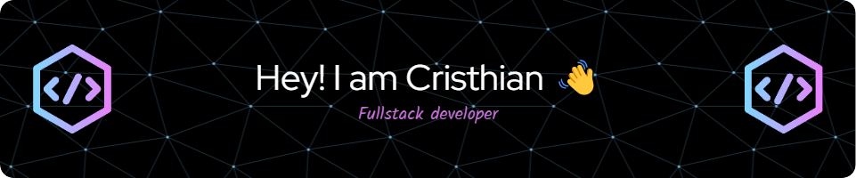

  

### 
I'm Cristhian Rodriguez Zavaleta, a full-time full-stack freelance developer 👨‍💻
  

- 🌱 I’m currently learning **Django** and **Nuxt** 
  

- ❓ Ask me about anything related to **MERN** stack and related technologies  
  

- 📄 Learn about my experiences in my [Portfolio](https://portafoliodev-theta.vercel.app/)  

   

## My Skill Set  
<table><tr><td valign="top" width="50%">

### Frontend  

  
  
  
  
  
  
  
  
  
  
  
  
  
  
  
  
  
  

</td><td valign="top" width="50%">

### Backend  

  
  
  
  
  
  
  
  
  
  

</td></tr></table>  

   

## Connect with me  

  
  

   
